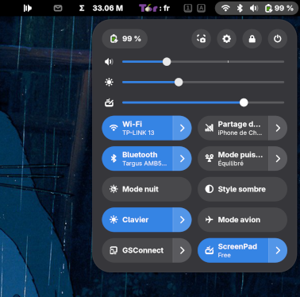
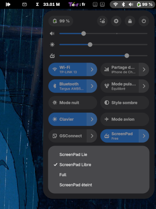
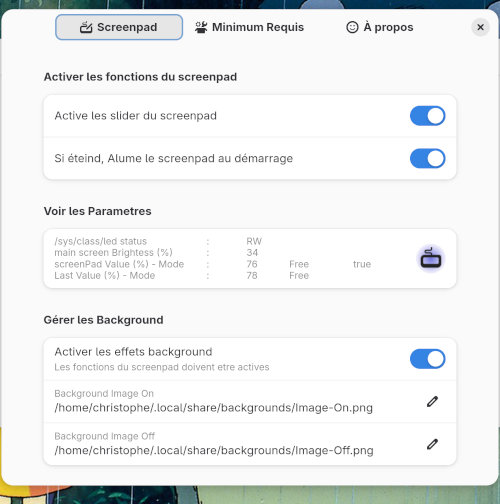

# Extension GNOME pour Asus ZenBook Duo
### By Christophe Theodore

### This extension is not affiliated, funded,or in any way associated with Asus.


Slider             |  Toggle Switch
:-------------------------:|:-------------------------:
 | 

## Features

Control the secondary display (ScreenPad) on Asus ZenBook Duo laptops with GNOME:
Brightness Modes:
  - Linked      : Syncs with main display
  - Free        : Independent control
  - Full        : Maximum brightness
  - Off         : Disables ScreenPad

Wallpapers: Automatic adaptation based on ScreenPad state

## Requirements

### Hardware:
  - Asus ZenBook Duo (ScreenPad models)
    - Other model in the futur

### System:
  - Linux kernel ≥ 6.5 
    - note: if the kernel is lower, you can install the modul asus-wmi-screenpad manually see https://github.com/Plippo/asus-wmi-screenpad
  - GNOME Shell ≥ 45

### Permissions:
  - Read/write access to:
    - /sys/class/backlight/asus_screenpad/brightness
    - /sys/class/backlight/asus_screenpad/bl_power

### Installation
Install extension:
  - Via GNOME Extensions (https://extensions.gnome.org/)
  - via command line:
      ```
      gnome-extensions enable zenbookDuoIntegration@christophe.extension
      ```
  - Configure permissions:
    - Creez un fichier /etc/udev/rules.d/99-asus.rules
      ```
      sudo nano /etc/udev/rules.d/99-asus.rules
      ```
    - Copiez-y :
      ```
			# Règles pour Asus ScreenPad
			ACTION=="add", SUBSYSTEM=="backlight", KERNEL=="asus_screenpad", RUN+="/bin/chmod a+w /sys/class/backlight/%k/brightness"
			ACTION=="add", SUBSYSTEM=="backlight", KERNEL=="asus_screenpad", RUN+="/bin/chmod a+w /sys/class/backlight/%k/bl_power"
      ```
    - Redémarrez La cession où tout simplement les règles udev :
       ```
      sudo udevadm control --reload-rules
      ```

### Configuration

Access preferences:
via extensions application (https://extensions.gnome.org/) or command line
```
gnome-extensions prefs zenbookDuoIntegration@christophe.extension
```



Available options:
### - Enable ScreenPad controls
    - Enable screenpad sliders: Enables or disables the slider.
    - (All other functions become inaccessible if disabled.)
 ### - Auto-adjust on startup
     - Automatically adjusts the screenpad brightness to the main screen. IF:
      - this feature is enabled,
      - the computer or extension starts,
      - the screenpad was previously set to Off or Full.
### - Wallpaper management
    - Enable background effects: Automatically changes the screen background. IF:
      - this feature is enabled,
      - when the screenpad is turned on or off.
 ### - Custom wallpaper paths
     - Background Image On (Off): Background image file.


## En Francais


Slider             |  Toggle Switch
:-------------------------:|:-------------------------:
 | 

## Fonctionnalités

Cette extension permet de contrôler l'écran secondaire (ScreenPad) des ordinateurs portables Asus ZenBook Duo sous GNOME :
Le réglage de la luminosité du ScreenPad se controle en fonction du mode choisi:
  - Linked ( Lié )      : Synchronisé avec l'écran principal.
  - Free ( Libre )	    : Contrôle indépendant.
  - Full ( Maximum )	  : Luminosité au maximum.
  - Off ( Éteint )	    : Désactivation complète.

Les fonds d'écran sont peuvent s'adapter à la demande.


## Prérequis

### Matériel:
  - Possèder un ordinateur asus ZenBook Duo
    - Il est probable que cette extension puisse ètre adaptée à d'autre type d'ordinateur.
    - Les versions future de cette extension iront dans ce sens.

### système:
  - Le Noyau Linux doit être supérieur où égale à 6.5.
    - Noter que pour les noyeau inferieur, le module asus-wmi peut etre installé manuellement (Voir le site de Plippo https://github.com/Plippo/asus-wmi-screenpad)
  - GNOME Shell doit être supérieur où égale à 45

### Permissions:
  - Avoir les droits en lecture et écriture (RW) dans les fichier system :
    - /sys/class/backlight/asus_screenpad/brightness 	( pour le control de la luminosité ),
    - /sys/class/backlight/asus_screenpad/bl_power 	( pour l'allumage et l'extinction).

### Installation
L'installation de l'extension Asus ZenBook Duo Intégration pour gnome, se fait de manière standard ,en téléchargeant et activant l'extension.
	NOTEZ QUE pour l’accès aux fichiers système, un fichier dev/rules doit être ajouté manuellement.

  - Téléchargez l'extension depuis [GNOME Extensions](https://extensions.gnome.org/)
  - Activez l'extension à l'aide de l'application `Extensions` ou avec la commande
      ```
      gnome-extensions enable zenbookDuoIntegration@christophe.extension
      ```
  - Configurez les permissions :
    - Creez un fichier /etc/udev/rules.d/99-asus.rules
      ```
      sudo nano /etc/udev/rules.d/99-asus.rules
      ```
    - Copiez-y :
      ```
			# Règles pour Asus ScreenPad
			ACTION=="add", SUBSYSTEM=="backlight", KERNEL=="asus_screenpad", RUN+="/bin/chmod a+w /sys/class/backlight/%k/brightness"
			ACTION=="add", SUBSYSTEM=="backlight", KERNEL=="asus_screenpad", RUN+="/bin/chmod a+w /sys/class/backlight/%k/bl_power"
      ```
    - Redémarrez La cession où tout simplement les règles udev :
       ```
      sudo udevadm control --reload-rules
      ```

### Configuration
Accédez aux paramètres à l'aide de l'application `Extensions` ou avec la commande :

```
gnome-extensions prefs zenbookDuoIntegration@christophe.extension
```


    
###  - Active les slider du screenpad
    - Active ou désactive le slider,
    - (Toutes les autres fonctions devienne inaccessible si inihbé)

###  - Si éteind, Alume le screenpad au démarrage
    - Automatiquement ajust la luminosité du screenpad a celle de l'écran principale SI:
      - cette fonction est activée,
      - l'ordinateur ou l'extension démarre,
      - Le screenpad était précédement Off où Full

###  - Activer les effets background
    - Change automatiquement le background de l'écran SI:
       - cette fonction est activée,
       - à l'allumage ou l'extinction du screenpad.

###  - Background Image On (Off)
     - Fichier Image des backgrounds

## Pour les Développeurs


### Structure

L'extension suit une structure standard gnome:
```
├── extension.js
├── prefs.js
├── metadata.json
├── readme.md
├── Config/
│	 └── config.js
├── ClassObjects/
│	 ├── functions.js
│	 ├── quicksettingobjects.js
│	 └── screenpadobjects.js
├── locale/
│	 ├── fr/
│	 │	 └── LC_MESSAGES
│	 │		 └── zenbookduointegration.mo
│	 ├── en/
│	 │	 └── LC_MESSAGES
│	 │		 └── zenbookduointegration.mo
│	 └── ect...
├── Media/
│	 ├── input-tablet-symbolic-xxx.svg
│	 └── input-tablet-symbolic-xxx-pref.svg
├── schemas/
	 ├── org.gnome.shell.extensions.xxx.xml	
	 └── gschemas.compiled
```

### Contributions
Les contributions sont les bienvenues ! Pour contribuer :
  - Forkez le dépôt
  - Créez une branche (git checkout -b feature/ma-fonctionnalite)
  - Committez vos changements (git commit -am 'Ajout d'une super fonctionnalité')
  - Pushez (git push origin feature/ma-fonctionnalite)
  - Créez une Pull Request


### Licence
GPL-2.0 - Voir la licence complète
		https://www.gnu.org/licenses/old-licenses/gpl-2.0.fr.html


## Variable et autre settings :


### Généralité
```
	// ------------------------------------------------------------------------------------------------------------- //
	// 		./readme.md																								 //
	// 																												 //
	// 		Code ecrit par Christophe Theodore																		 //
	// 		Licence : GPL-2.0, logiciel libre, vous pouvez le copier et l'utiliser librement						 //
	// 		Intégration des fonctions de l'Asus ZenBook Duo dans GNOME Shell										 //
	// 		Merci à la communauté pour les bouts de codes pèché ici et la.											 //
	// ------------------------------------------------------------------------------------------------------------- //

	// ------------------------------------------------------------------------------------------------------------- //
	// 		Inspiré par une extension écrite par jibsaramnim and lunaneff											 //
	// 		https://github.com/lunaneff/gnome-shell-extension-zenbook-duo											 //
	// 		Le code à été entièrement revu et modifié																 //
	// 		je remercie les auteurs.																						//
	// ------------------------------------------------------------------------------------------------------------- //
```

Le setting
```
	// ------------------------------------------------------------------------------------------------------------- //
	// screenpad-extension-activated	type b		Active les slider du screenpad.									 //
	// screenpad-brightness				type i		Val	(0 à 100) -> (0 à 255) dans /sys/class..					 //
	// main-brightness 					type i		Val	(0 à 100)													 //
	// screenpad-mode 					type s		Mode de mouvement du slider										 //
	// 												Linked															 //
	// 												Free															 //
	// 												Full 															 //
	// 												Off																 //
	// screenpad-status 				type b		Etat de la backlight											 //
	// 												true 	ON,		/sys/class/backlight/asus_screenpad/bl_power = 0 //
	// 												false 	OFF,	/sys/class/backlight/asus_screenpad/bl_power = 1 //
	// sys-class-led-status 			type s		/sys/class/backlight/asus_screenpad/brightness					 //
	// 												NA -> Not Applicable (Main.panel.statusArea...not exist)		 //
	// 												00 -> inexistant												 //
	// 												RO -> readOnly													 //
	// 												RW -> readWrite													 //
	// asus-cmd 						type s		Commande perso pour F12											 //
	// creenpad-last-state 				type as		Sauvegarde des dernières valeur en mode Off						 //
	// background-activated 			type b		Prise en compte du background image								 //
	// background-image-on 				type s		location du background on										 //
	// background image off 						/home/christophe/.local/share/backgrounds/Image-Off.png			 //
	// ------------------------------------------------------------------------------------------------------------- //
```
Forcément, remplacer christophe par votre /home/user/...


Pour Fonctionner
```
  // ------------------------------------------------------------------------------------------------------------- //
  // 		Pour Fonctionner, cette extension a besoin d'un acces à 												 //
  // 				/sys/class/leds/asus::screenpad/brightness														 //
  //			ET	/sys/class/backlight/asus_screenpad/bl_power													 //
  //																												 //
  // 		EN Lecture ET écriture																					 //
  // 		/etc/udev/rules.d/99-asus.rules authorise l'acces en écriture											 //
  //-------------------------------------------------------------------------------------------------------------- //
```
Pour ce faire, créer un fichier : 
/etc/udev/rules.d/99-asus.rules
```

# rules for asus_nb_wmi devices
# make screenpad backlight brightness write-able by everyone

ACTION=="add", SUBSYSTEM=="backlight", KERNEL=="asus_screenpad", RUN+="/bin/chmod a+w /sys/class/leds/%k/brightness"
ACTION=="add", SUBSYSTEM=="backlight", KERNEL=="asus_screenpad", RUN+="/bin/chmod a+w /sys/class/backlight/asus_screenpad/bl_power"
```

Demmarage de l extension
```
  // ------------------------------------------------------------------------------------------------------------- //
  // 		verification 	de 	/sys/class/leds/asus::screenpad/brightness											 //
  //						ou	/sys/class/backlight/asus_screenpad/bl_power										 //
  // 				NA -> Not Applicable (slider inaccessible) 														 //
  //				00 -> inexistant 																				 //
  // 				RO->readOnly 																					 //
  // 				RW->readWrite 																					 //
  // 		ecriture dans le setting screenpad-mode 																 //
  // ------------------------------------------------------------------------------------------------------------- //
```

```
  // ------------------------------------------------------------------------------------------------------------- //
  // 		La fin																									 //
  //-------------------------------------------------------------------------------------------------------------- //
```

